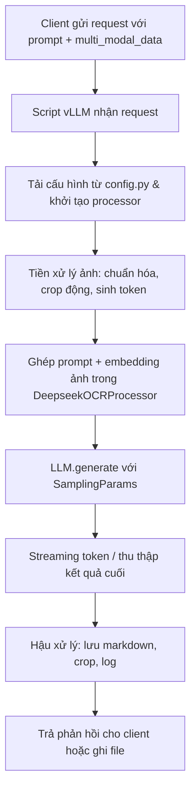

# Tài liệu Logic API và Luồng yêu cầu DeepSeek-OCR

## Phạm vi tài liệu
Tài liệu này mô tả logic nghiệp vụ cốt lõi, cấu trúc API suy luận và dòng chảy xử lý yêu cầu cho hai kịch bản chính: ảnh đơn và tài liệu nhiều trang.

## Định nghĩa API nội bộ
- **Điểm vào vLLM**: khởi tạo thông qua `LLM(model="deepseek-ai/DeepSeek-OCR", ...)` kết hợp với lớp `DeepseekOCRForCausalLM` tùy biến.【F:DeepSeek-OCR-master/DeepSeek-OCR-vllm/run_dpsk_ocr_image.py†L147-L199】
- **Định dạng request**:
  ```python
  {
      "prompt": "<image>\n<|grounding|>Convert the document to markdown.",
      "multi_modal_data": {"image": Image.open(path).convert("RGB")}
  }
  ```
  Cấu trúc trên khớp với ví dụ trong README và cho phép mở rộng `multi_modal_data` cho nhiều ảnh nếu cần.【F:README.md†L97-L129】
- **Tham số suy luận**: `SamplingParams` kiểm soát nhiệt độ, giới hạn token, và `extra_args` cho bộ lọc n-gram giúp kiểm soát chất lượng kết quả.【F:README.md†L99-L126】

## Luồng xử lý yêu cầu


## Mô tả từng bước chi tiết
1. **Tiếp nhận yêu cầu**: script `run_dpsk_ocr_image.py` hoặc `run_dpsk_ocr_pdf.py` nạp tham số CLI, đọc tệp đầu vào, khởi tạo lớp `DeepseekOCRProcessor` với cấu hình tương ứng.【F:DeepSeek-OCR-master/DeepSeek-OCR-vllm/run_dpsk_ocr_image.py†L146-L215】【F:DeepSeek-OCR-master/DeepSeek-OCR-vllm/run_dpsk_ocr_pdf.py†L84-L170】
2. **Chuẩn hóa dữ liệu**: processor chuyển ảnh sang tensor, cắt lát (nếu bật), và đánh dấu vị trí `<image>` trong chuỗi token.【F:DeepSeek-OCR-master/DeepSeek-OCR-vllm/process/image_process.py†L241-L435】
3. **Mã hóa & suy luận**: `LLM.generate` gọi `_pixel_values_to_embedding` để ghép đặc trưng ảnh với prompt và sinh token văn bản theo sampling param.【F:DeepSeek-OCR-master/DeepSeek-OCR-vllm/deepseek_ocr.py†L364-L553】
4. **Hậu xử lý**: script gom từng token thành đoạn văn, lưu file markdown, ảnh crop và thông tin bounding box tùy cấu hình `save_results`/`test_compress`.【F:DeepSeek-OCR-master/DeepSeek-OCR-vllm/run_dpsk_ocr_image.py†L204-L303】
5. **Phản hồi**: kết quả được phát trực tiếp (stream) ra console hoặc ghi vào thư mục đầu ra, phục vụ tích hợp với dịch vụ upstream.【F:DeepSeek-OCR-master/DeepSeek-OCR-vllm/run_dpsk_ocr_image.py†L200-L303】

## Biến thể luồng đối với PDF
- **Tiền xử lý nhiều trang**: `run_dpsk_ocr_pdf.py` rasterize từng trang rồi đưa qua processor theo batch, giúp tận dụng GPU tốt hơn.【F:DeepSeek-OCR-master/DeepSeek-OCR-vllm/run_dpsk_ocr_pdf.py†L84-L170】
- **Quản lý kết quả**: mỗi trang tạo một file markdown/ảnh riêng, đồng thời trả về báo cáo tổng hợp để dễ kiểm thử.【F:DeepSeek-OCR-master/DeepSeek-OCR-vllm/run_dpsk_ocr_pdf.py†L137-L170】

## Quy tắc chất lượng đầu ra
- Luôn bật `NGramPerReqLogitsProcessor` để hạn chế lặp từ, đặc biệt khi request yêu cầu bảng HTML hoặc Markdown phức tạp.【F:DeepSeek-OCR-master/DeepSeek-OCR-vllm/run_dpsk_ocr_image.py†L147-L199】
- Sử dụng prompt có chỉ dẫn rõ ràng (ví dụ thêm `<|grounding|>` hoặc mô tả định dạng) để mô hình sinh kết quả đúng mục tiêu nghiệp vụ.【F:README.md†L97-L129】
- Kiểm soát `max_tokens` dựa trên độ dài tài liệu nhằm tránh cắt ngắn kết quả hoặc tiêu tốn tài nguyên không cần thiết.【F:README.md†L99-L126】
